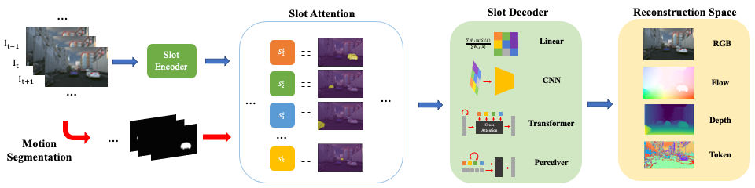

# Object Discovery from Motion-Guided Tokens

This is the repository for [*Object Discovery from Motion-Guided Tokens*](https://arxiv.org/abs/2303.15555), published at CVPR 2023.  


[[Project Page](https://zpbao.github.io/projects/MoTok/)]
[[Paper](https://arxiv.org/abs/2303.15555)]




## Set up

Python 3 dependencies:

* torch 1.7.1+CUDA11.0 
* matplotlib
* cv2
* numpy
* scipy
* tqmd


## Datasets
### MOVi-E
MOVi-E dataset can be accessed from [the official repo](https://github.com/google-research/kubric/tree/main/challenges/movi). After downloading, we save the data to npy files for training. See ```process_movi.py``` for details.

### TRI-PD
**Depth, semantic masks, bounding boxes will be uploaded in late April (expected)**  
PD datasets (RGB, flow, depth) and additional annotations (moving object masks; dynamic object masks): [[TRI-PD dataset]](https://drive.google.com/drive/folders/1q5AjqhoivJb67h9MZCgUtqb4CooDrZhC?usp=sharing)

Raw PD dataset (which contains RGB, semantic segmentation, instance segmentation, optical flow, depth, camera colibrations, 2D/3D bounding boxes, etc.) is connected to TRI's [Vidar](https://github.com/TRI-ML/vidar) project. Leave a message in the issues or contact `zbao@andrew.cmu.edu` for the annotations other than the simplified ones.


Sample code to transfer the motion vectors to flow xy:

```
rgba = cv2.imread('x.png',-1)
r,g,b,a = rgba[:,:,0], rgba[:,:,1], rgba[:,:,2], rgba[:,:,3]
h,w,_ = flow.shape
dx_i = r+g*256
dy_i = b+a*256
flow_x = ((dx_i / 65535.0)*2.0-1.0) * w
flow_y = ((dy_i / 65535.0)*2.0 - 1.0) * h            
```

To download the files in google drive from a server, please check [gdown](https://pypi.org/project/gdown/). Some sample code to download the files in the folder:

```
import gdown
url = "https://drive.google.com/drive/folders/1q5AjqhoivJb67h9MZCgUtqb4CooDrZhC"

gdown.download_folder(url, quiet = False, use_cookies = False)

```

### KITTI
KITTI dataset can be downloaded from the [offcial website](https://www.cvlibs.net/datasets/kitti/) we use all the RGB images for training. The motion segmentations we used can be downloaded from [here](https://drive.google.com/drive/folders/1q5AjqhoivJb67h9MZCgUtqb4CooDrZhC?usp=sharing)


### Dataset structure
####MOVI
```
root 
	- train
		- video-0000
			- rgb.npy
			- forward_flow.npy
			- backward_flow.npy
			- depth.npy
			- segment.npy
		- video-0001
		- ...
	- val
	- test
```


####TRI-PD

```
root 
   - scene_000001
      - rgb
         - camera_01
            - 000000000000000005.png
            - ...
         - camera_04
         - camera_05
         - camera_06
         - camera_07
         - camera_08
         - camera_09
      - motion_vectors_2d
      - back_motion_vectors_2d
      - moving_masks
      - ari_masks
      - est_masks
   - scene_000003
   - ...
```

####KITTI
```
root
	- 2011_09_26_drive_0001_sync
		- image_02
			- data
				- 0000000000.png
				- 0000000001.png
				- ...
			- raft_seg
				- 0000000000.png
				- 0000000001.png
				- ...
		- image_03
			- data
			- raft_seg
	- 2011_09_26_drive_0002_sync
	- ...
```

### Train the model 

See ```trainPD.sh```, ```trainKITTI.sh``` and ```trainMOVI.sh```for sample training scripts. See args in the training python scripts for details.


### Evaluating the pre-trained model

To evaluate or infer on the test set, first download the pre-trained model (or train it with the training code), then run

```python eval(movi/pd/kitti).py``` 

Notice that we provide the version without motion cue on MOVi-E and with motion cue on TRI-PD and KITTI.

### Visualize the slot masks

To infer and visualize on a video of arbitary length, see

```Plot.py```

for a sample code.

### Pre-trained models

Pre-trained models are located in the pre-trained models folder in [this](https://drive.google.com/drive/folders/1q5AjqhoivJb67h9MZCgUtqb4CooDrZhC?usp=sharing) drive.

### Other helpful codes
In this repo, we mainly provide the architecture for VQ-space + perceiver decoder. More implementations about different choices of decoders and reconstruction space shown in our paper can be found in the folder ```others```.


## Acknowledgement
The slot attention modules is referred to the [pytorch slot attention](https://github.com/evelinehong/slot-attention-pytorch) and [the official google repo](https://github.com/google-research/google-research/tree/master/slot_attention), the estimated motion segments are generated by [Towards segmenting anything that moves](https://github.com/achalddave/segment-any-moving) repo. 

For the estimated annotation generations, we use [smurf](https://github.com/google-research/google-research/tree/master/smurf) and [Vidar](https://github.com/TRI-ML/vidar).

## Previous work
[Discovering objects that can move](https://github.com/zpbao/Discovery_Obj_Move)

```
@inproceedings{bao2022discovering,
    Author = {Bao, Zhipeng and Tokmakov, Pavel and Jabri, Allan and Wang, Yu-Xiong and Gaidon, Adrien and Hebert, Martial},
    Title = {Discorying Object that Can Move},
    Booktitle = {CVPR},
    Year = {2022},
}
```

## Citation

```
@inproceedings{bao2023object,
    Author = {Bao, Zhipeng and Tokmakov, Pavel and Wang, Yu-Xiong and Gaidon, Adrien and Hebert, Martial},
    Title = {Object Discovery from Motion-Guided Tokens},
    Booktitle = {CVPR},
    Year = {2023},
}
```

